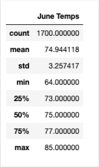

# surfs_up

## Overview of Analysis
In this study, information which is given in , about temperature trends was analyzed in order to  determine if the surf and ice cream shop business is sustainable year-round.

The analyse hase done by using the python codes .

In the report the results of  temperature data for the months of June and December in Oahu were analysed. In addition to this the summary statistics of precipitation data for the months June and December are displayed and discussed to give more detailed analysis for the weahther condition year-round.

### Purpose

The Porpose of the work is to investigate the weather condition of Oaha to determine if the surfa and ice cream shop business is sustainable year-round.

## Analysis of Results

### 1. Analysis of Temperature in June

The summary statistics of temperature of the Oaha was found out by the following code:

> from sqlalchemy import extract
> 
> june_temp = session.query(Measurement.tobs).filter(extract('month',Measurement.date)==6).all()
>                        
> june_temp_df = pd.DataFrame(june_temp, columns=['June Temps'])
> 
> june_temp_df.describe()

The output is the following:

>## 2. Analysis of Temperature in December

### 3. Comparison of Results of June and December

## Summary

