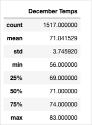

# surfs_up

## Overview of Analysis
In this study, information which is given in , about temperature trends was analyzed in order to  determine if the surf and ice cream shop business is sustainable year-round.

The analyse has done by using the python codes .

In the report the results of  temperature data for the months of June and December in Oahu were analysed. In addition to this the summary statistics of precipitation data for the months June and December are displayed and discussed to give more detailed analysis for the weahther condition year-round.

### Purpose

The Purpose of the work is to investigate the weather condition of Oaha to determine if the surf and ice cream shop business is sustainable year-round.

## Analysis of Results

### 1. Analysis of Temperature in June

The summary statistics of temperature of the Oaha in June was found out by the following code:

> from sqlalchemy import extract
> 
> june_temp = session.query(Measurement.tobs).filter(extract('month',Measurement.date)==6).all()
>                        
> june_temp_df = pd.DataFrame(june_temp, columns=['June Temps'])
> 
> june_temp_df.describe()

The output is the following:

According to this result, the minimum temperature is 64, on more than 75 % of the June days the temperature is more than 73 and the mean temperature is 74.94.

This resulst shows that the weather is suitable for the surf and ice cream shop in terms of temperature in June.

## 2. Analysis of Temperature in December

The summary statistics of temperature of the Oaha in December was found out by the following code:

> december_temp = session.query(Measurement.tobs).filter(extract('month',Measurement.date)==12).all() 
> 
> december_temp_df = pd.DataFrame(december_temp, columns=['December Temps'])
> 
>  december_temp_df.describe() 

The following table diplays the output:

According to this result, the minimum temperature is 56, on more than 75 % of the December days the temperature is more than 69 and the mean temperature is 71.04. Only on 25 % of the December days the tenperature looks not suitable to surf.

This resulst shows that the weather is mostly suitable for the surf and ice cream shop in terms of temperature in December.

### 3. Comparison of Results of June and December

Let's look at the results together in the same table.

If we compare the summary statistics of temperatures in two months we can see that there is no big difference between these two statisticas. From which we can understand that the surf and ice cream shop business is sustainable year-round.

We can support this idea visually by the following  Multy Box Plot.

## Summary

In summary we can say that the surf and ice cream shop business is sustainable year-round.

We can support this idea by making query about precipitation in both June and December. The statistics summary together is given in the following table:

According to table, the averages precipitation in June and December are 0.136 and 0.216 respectively; similarly the maximum precipitation in June and December are 4.43 and 6.42 respectively. There is no big difference between them. On 75 % of June days the precipitation is smaller than 0.12 and on 75 % of December days the precipitation is smaller than 0.15. From which we can conclude that the surf and ice cream shop business is sustainable year-round.

